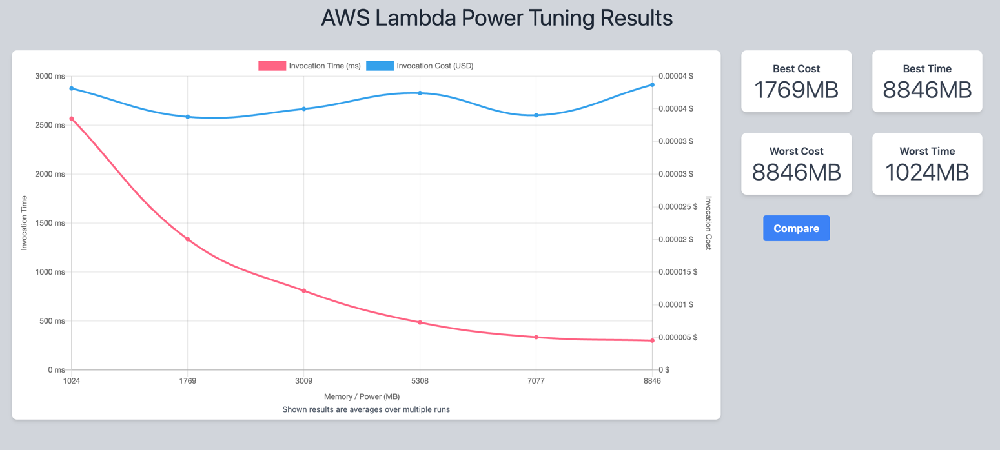

# What is this ?
Simple demo of running a Rust Lambda function with yolov10. Uses the [usls library](https://github.com/jamjamjon/usls)
Demonstrates user-friendly cold starts and ms latency inference.

# Setup
 Ensure proper AWS credentials are set up in the deployment environment

# Deployment
`./build-and-deploy.sh`
this is short for: `sam build --beta-features && sam deploy --no-confirm-changeset`

# Test
`test-in-cloud.sh`
This will HTTP POST the image to the endpoint and save the annotated image to `output.jpg`

# Inspect Logs
`sam logs`

# Run power tuning
run `power-tuning/execute.sh`

Example output:

* Optimizing the model:

pip install onnxruntime, onnx, protobuf

`python -m onnxruntime.tools.convert_onnx_models_to_ort layer/model --optimization_style Fixed --save_optimized_onnx_model --target_platform amd64`

* Output

`(py310) ➜  rust-lambda-inference git:(main) ✗ python -m onnxruntime.tools.convert_onnx_models_to_ort layer/model --optimization_style Fixed --save_optimized_onnx_model --target_platform amd64
Converting models with optimization style 'Fixed' and level 'all'
Saving optimized ONNX model /Users/jah/isato_labs/rust-lambda-inference/layer/model/yolov10x.onnx to /Users/jah/isato_labs/rust-lambda-inference/layer/model/yolov10x.optimized.onnx
2024-06-30 11:38:32.763593 [W:onnxruntime:, inference_session.cc:1978 Initialize] Serializing optimized model with Graph Optimization level greater than ORT_ENABLE_EXTENDED and the NchwcTransformer enabled. The generated model may contain hardware specific optimizations, and should only be used in the same environment the model was optimized in.
Converting optimized ONNX model /Users/jah/isato_labs/rust-lambda-inference/layer/model/yolov10x.onnx to ORT format model /Users/jah/isato_labs/rust-lambda-inference/layer/model/yolov10x.ort
2024-06-30 11:38:32.985152 [W:onnxruntime:, inference_session.cc:1978 Initialize] Serializing optimized model with Graph Optimization level greater than ORT_ENABLE_EXTENDED and the NchwcTransformer enabled. The generated model may contain hardware specific optimizations, and should only be used in the same environment the model was optimized in.
Converted 1/1 models successfully.
Generating config file from ORT format models with optimization style 'Fixed' and level 'all'
2024-06-30 11:38:33,309 ort_format_model.utils [INFO] - Created config in /Users/jah/isato_labs/rust-lambda-inference/layer/model/required_operators.config
`